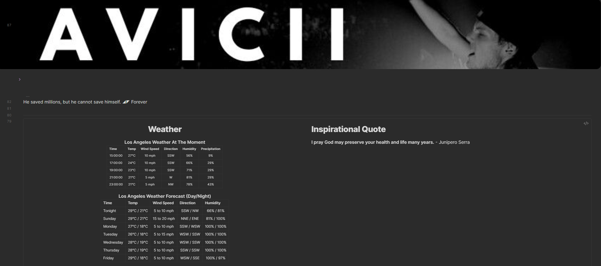
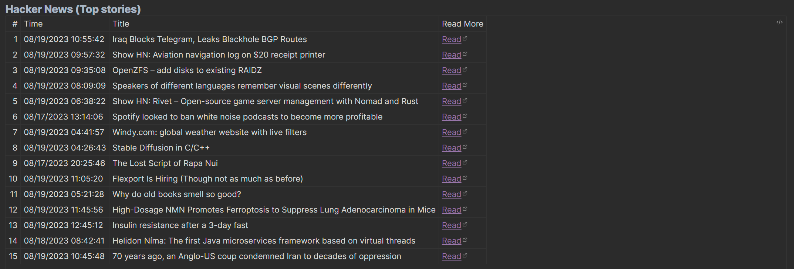

# CustomJS and Dataview API demo
This is a very simple demo of `CustomJS` and `Dataview` plugin. 
- I use CustomJS to fetch data from
	- Weather API `https://www.weather.gov/documentation/services-web-api` 
	- HackersNews API `https://hacker-news.firebaseio.com/v0/topstories.json`
- Dataview to display the data inside note. (I usually place this inside banner dashboard so I see it first thing in the morning)

You might need some programming knowledge to get this working or just modify this demo project to your need. 
I will try my best to explain every single detail so you can create your own customJS script.

At anytime you having issue with javascript, use `Ctrl + Shift + i` to open the developer console and see if you can track the error.
## Weather

### In the notes where you want to display the content add the following:
1. Import the class using `const {WeatherGov} = customJS;`. This `WeatherGov` is the same name as your javascript file's class name.
2. Create a new div container in your note page to hold the data
3. Call the class function `.getWeather(element)` and wait for asynchronous function to finish
	1. Passing in the div container so it can be modify by javascript functions
	2. Asynchronous function are function that process in the background, so this fetching process (if very long) will not block your UI from freezing/waiting on the request to finish
### Code
Just read the code, it got comment on every line

```dataviewjs
const {WeatherGov} = customJS;
let element = this.container.createEl('div', {cls: ["tailwind"]});
await WeatherGov.getWeather(element)
```

## Hacker News

### In the notes where you want to display the content add the following:
1. Import the class using `const {News} = customJS;`. This `Newr` is the same name as your javascript file's class name.
2. Create a new div container in your note page to hold the data
3. Call the class function `.getNews(element)` and wait for asynchronous function to finish
	1. Passing in the div container so it can be modify by javascript functions
	2. Asynchronous function are function that process in the background, so this fetching process (if very long) will not block your UI from freezing/waiting on the request to finish
### Code
Just read the code, it got comment on every line
```dataviewjs
const {News} = customJS;
let element = this.container.createEl('div', {cls: ["tailwind"]});
await News.listNews(element, 15);
```
